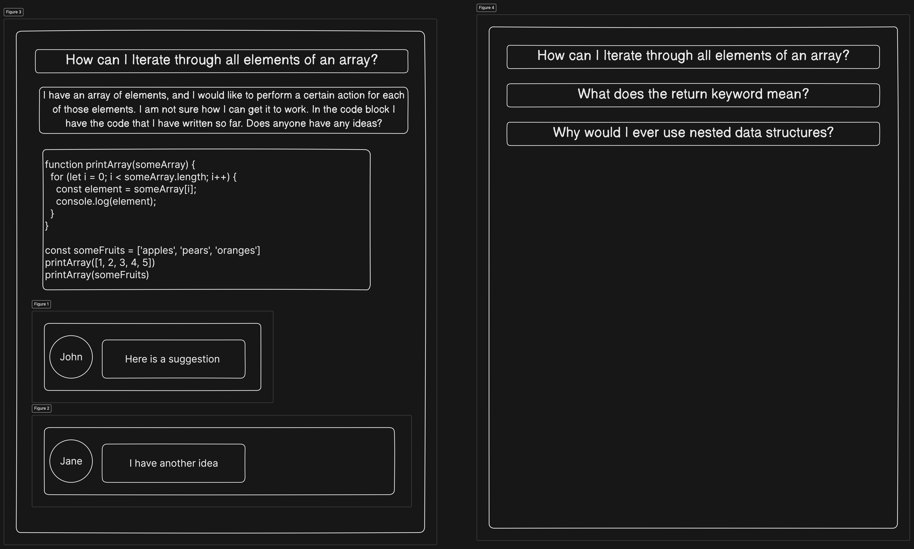

# CodeQuestionApp

## Description

A place for asking questions and discussing code. This platform can be used for asking questions about code to a community of developers. It should be possible to add a title, a description and some code to the question. Other developers can then browse the different questions on the platform and provide answers to the questions.

## Main features

- A user should be able to post a question consisting of a:
  - Title
  - Description
  - Code snippet / code block
- Other users should be able to comment / answer a question
- It should be possible to browse the different questions

## Mockup idea for UI

